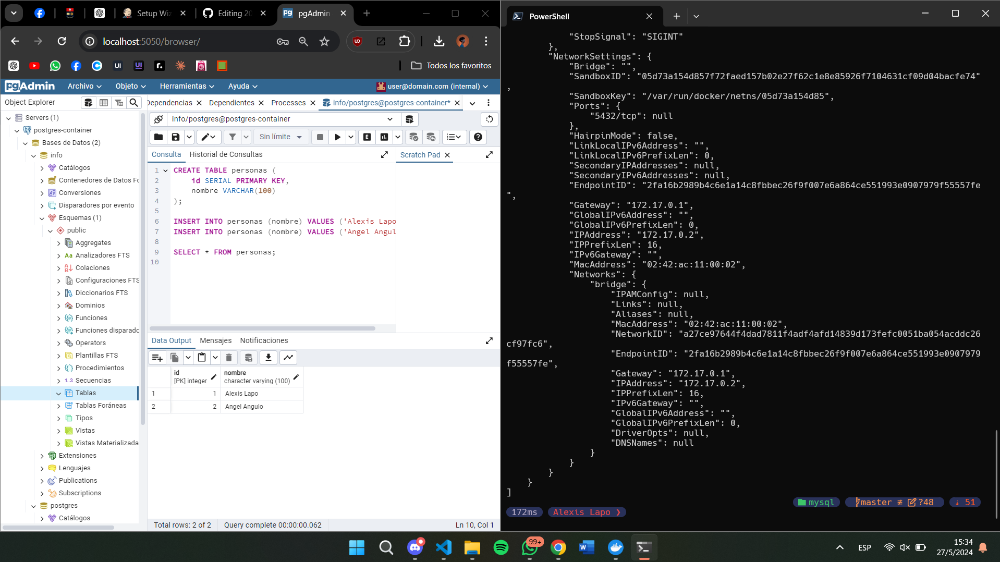

### Crear contenedor de Postgres sin que exponga los puertos. Usar la imagen: postgres:11.21-alpine3.17
# COMPLETAR
```
docker run -d --name postgres-container -e POSTGRES_PASSWORD=root postgres:11.21-alpine3.17
```
### Crear un cliente de postgres. Usar la imagen: dpage/pgadmin4
```
docker run -d --name pgadmin -p 5050:80 -e "PGADMIN_DEFAULT_EMAIL=user@domain.com" -e "PGADMIN_DEFAULT_PASSWORD=root" dpage/pgadmin4
```
# COMPLETAR

La figura presenta el esquema creado en donde los puertos son:
- a: (completar con el valor)
- b: (completar con el valor)
- c: (completar con el valor)


## Desde el cliente
### Acceder desde el cliente al servidor postgres creado.


# COMPLETAR CON UNA CAPTURA DEL LOGIN
### Crear la base de datos info, y dentro de esa base la tabla personas, con id (serial) y nombre (varchar), agregar un par de registros en la tabla, obligatorio incluir su nombre.
## Desde el servidor postgresl
### Acceder al servidor
### Conectarse a la base de datos info

### Realizar un select *from personas
# AGREGAR UNA CAPTURA DE PANTALLA DEL RESULTADO
